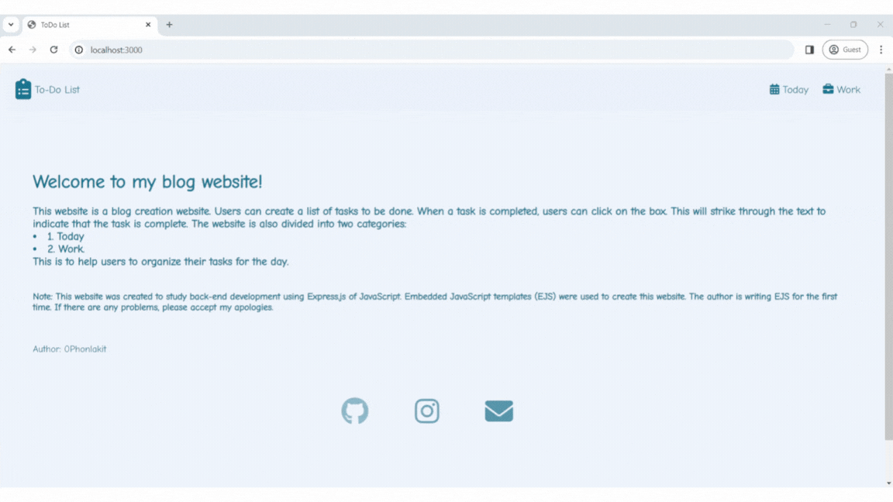
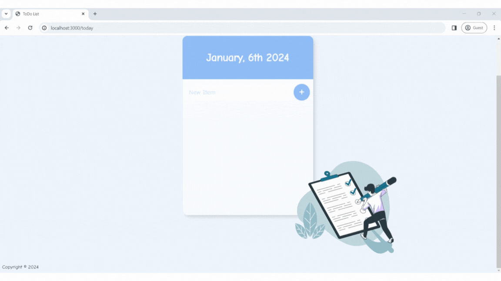
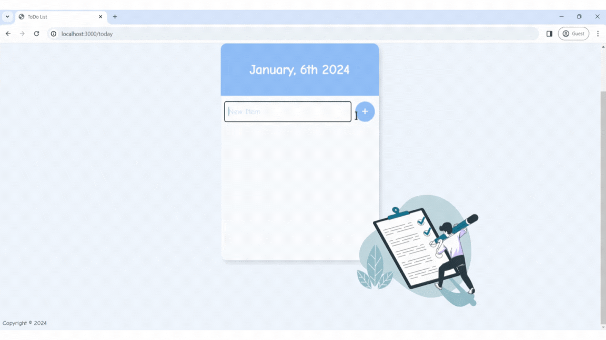
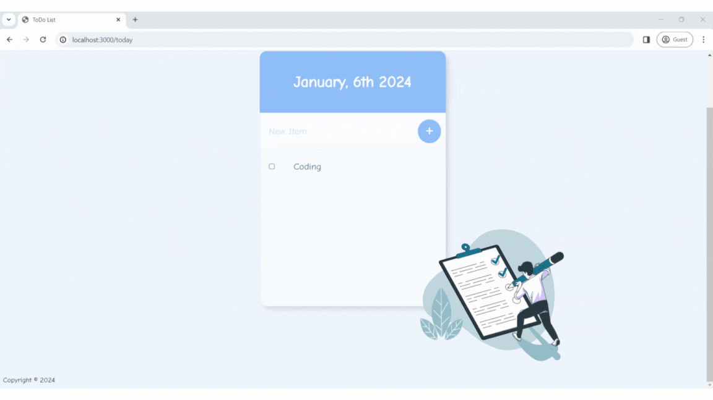
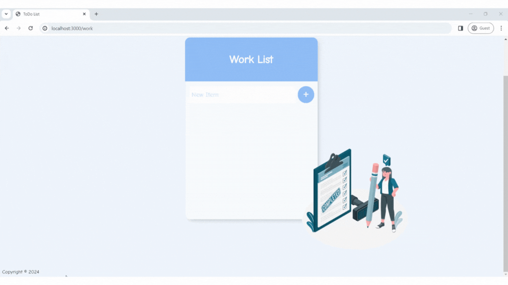
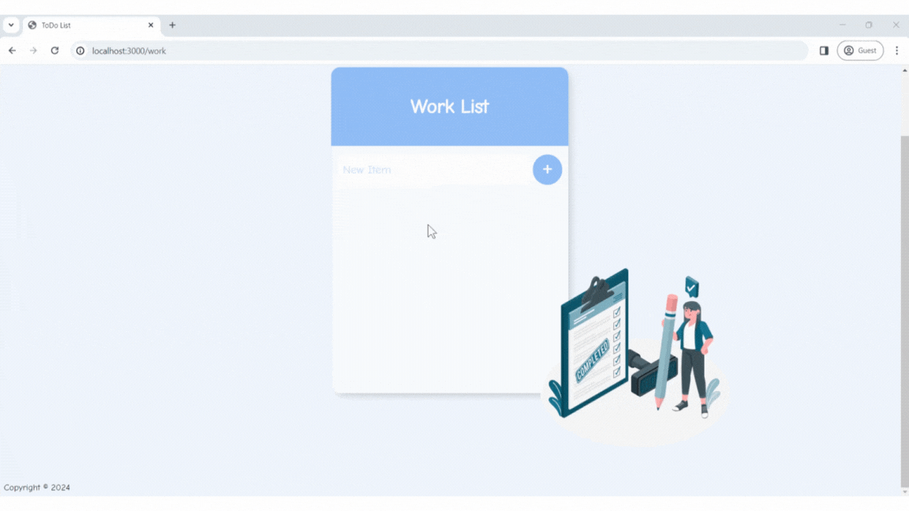
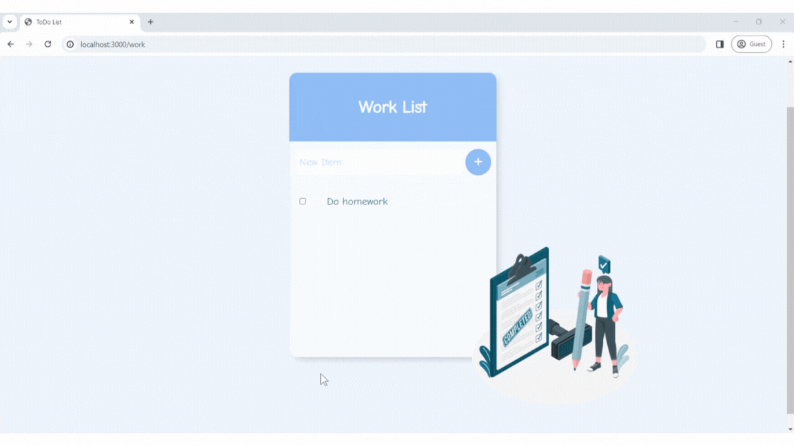
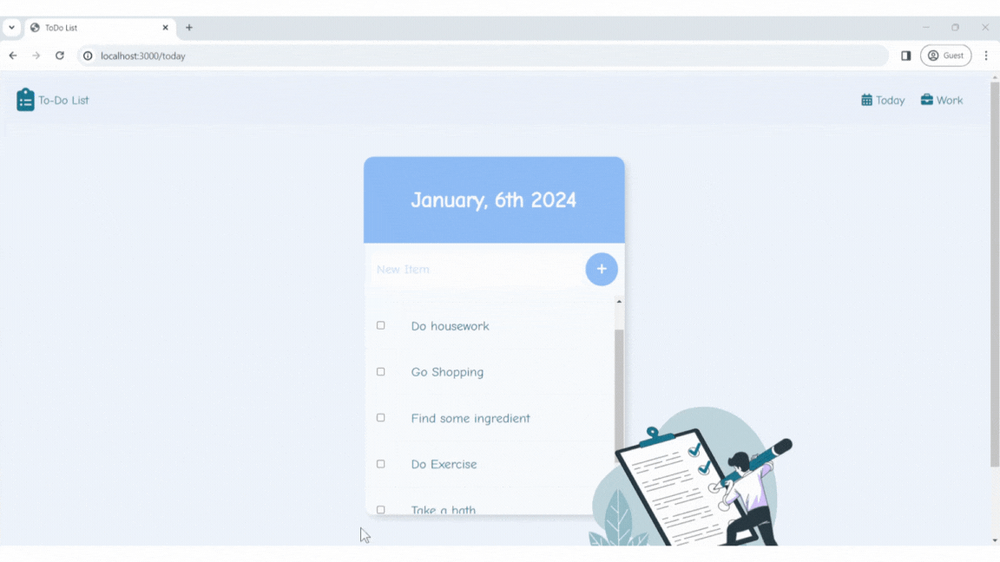

# Blog App

## About the website

This website is a study of how to use JavaScript with Embedded JavaScript templates (EJS) to create websites. The website is written in JavaScript to call EJS files.

## How to use and what you need

* The index.js file uses two main libraries:
   * **Express**: a library that opens the server
   * **BodyParser**: a library that stores user input

* To try out the website, you will need the following:
   * **Node.js**
   * **Node Package Manager (NPM)**

## Basic usage
1. After installing Node.js, open a terminal and install NPM using the command `npm i`.
2. Start the server using the command `node index.js.` If the server starts successfully, you will see the message "**Server running on port 3000**".
3. After starting the server, access the website at the **URL** : `http://localhost:3000/`.
4. To close the server, press **`Ctrl+C`**.

## Introduction to the website
This website is about creating a website that allows users to add tasks to be done on a specific day, as well as adding work to be done each day. The details are in the next section.

## Website details

**The Homepage is the first page that users will see. It will look like this:**

**This is the Today page, which is the page to add tasks to be done today.**

**After adding information on the Today page, it will look like this:**

**If you have completed a task on the Today page, mark it as completed.**

**Next is the Work page, which is the page to add work to be done.**

**After adding information on the Work page, it will look like this:**

**If you have completed a task on the Work page, mark it as completed.**

This section is a demonstration of how to use this website.

